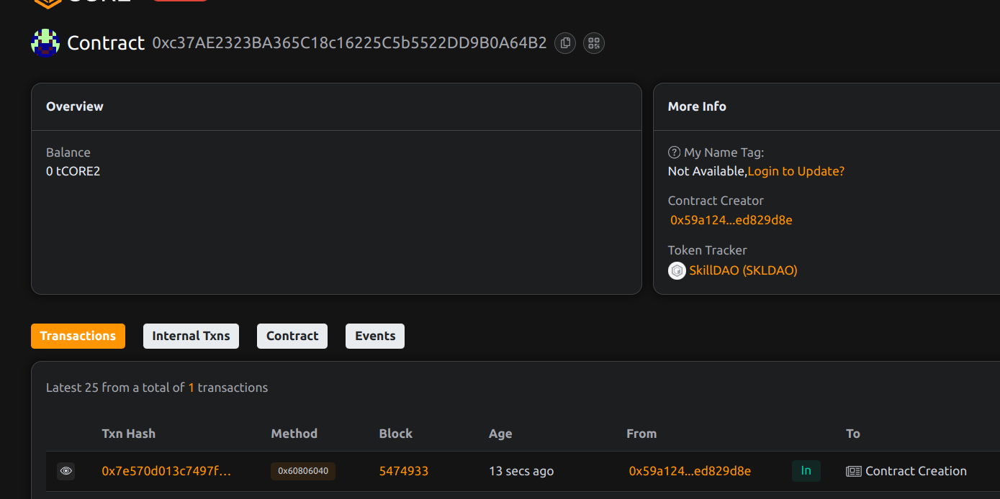

# SkillDAO: Tokenized Skill Certification and DAO-Based Endorsements

## Project Description
SkillDAO revolutionizes professional credentialing by combining NFT-based skill certifications with decentralized community endorsements. This creates a transparent, tamper-proof system for verifying professional competencies through collective intelligence.

## Project Vision
To build a decentralized alternative to traditional credentialing systems where:
- Skills are verifiable on-chain
- Endorsements carry economic weight
- Certifications are portable across platforms
- Community consensus validates expertise

## Key Features
- NFT-based skill certifications
- DAO-governed approval system
- Crowd-sourced endorsements
- Time-bound certifications
- Transparent credential history
- Anti-sybil mechanisms

## Future Scope
- Integration with professional networks
- Skill-based job matching
- Reputation-weighted governance
- Cross-chain credential portability
- Micro-certification system

## Contract Details
0xc37AE2323BA365C18c16225C5b5522DD9B0A64B2
